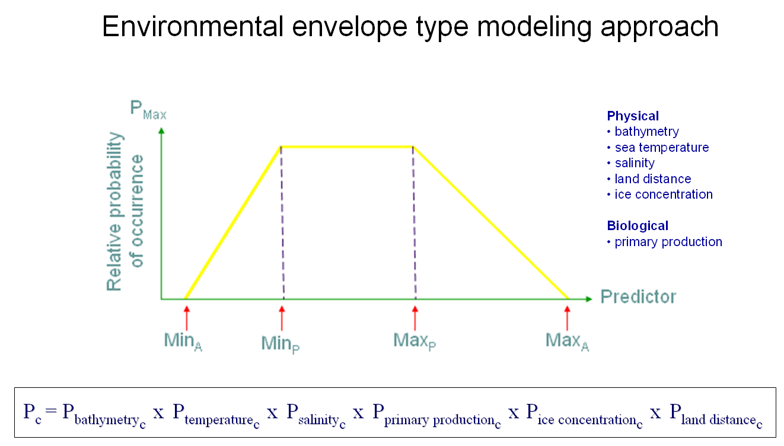
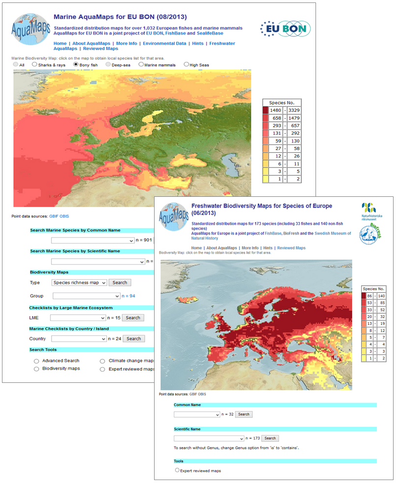

```{r setup, include=FALSE}
library(tufte)
knitr::opts_chunk$set(tidy = FALSE, cache.extra = packageVersion('tufte'))
options(htmltools.dir.version = FALSE)
```


# AquaMaps for EU BON 

AquaMaps  is  an  approach  to  generating  model-based,  largescale  predictions  of  where  aquatic species  occur  naturally.  The modelling  approach  uses  species  occurrence  data  coupled  with  expert knowledge to estimate species tolerances for environmental factors that can be used as predictors of species  presence  (e.g.,  depth,  sea  temperature,  salinity 
for  marine  species,  and  net  primary production,  soil  carbon,  elevation  for  freshwater  species). 

Predictions,  expressed  as  probabilities  of species  occurrence,  are  generated  by  matching  species  tolerances (environmental  envelopes) against  local  environmental  conditions  to  determine  the  relative  suitability  of  an  area  for  a  species (Fig.  1).  These  probabilities  are  illustrated  through  color-coded  species  range  maps  in  half-degree 
latitude and longitude cell resolution.  

The  AquaMaps  for  EU  BON  has  two  main  interfaces.  Marine  Aqua Maps  feature  standardized distribution maps for over 1,032 European fishes and marine mammals, while Freshwater AquaMaps  feature maps for 173 species (including 33 fishes and 140 non-fish species). These interfaces allow users  to  search,  view  and  explore  species  maps.  Experts  are  able  to  review,  modify  and  approve maps. 

```{marginfigure}
Figure 1. Model of a species-specific environmental envelope. A species will have an envelope for each of the environmental parameters used to predict its occurrence. In AquaMaps, the probability that a species is present is uniformly highest (P=1.00) where mean environmental conditions fall within the preferred parameter range of the species (MinP to MaxP). If environmental conditions fall outside this range, the probability of occurrence decrease linearly towards the species’ absolute minimum or maximum parameter thresholds (MinA or MaxA), and is set to zero (P=0.00) beyond these absolute thresholds. The overall probability of species occurrence in a cell (Pc) is the product of the probabilities of the environmental parameters considered for the species.
```



# Expected advantages

1. Addresses biases from occurrence data: Uses FishBase and SeaLifeBase to prevent inclusion of misidentified species. Incorporates of expert information on species-habitat preferences to counter sampling bias. Applies species distributions within FAO areas, bounding boxes or drainage basins to exclude potentially suitable habitat in which a species is not known to occur;
1. Easy species search: Call species maps using either common name or scientific name, or select from a checklist (e.g., by country or large marine ecosystem);
1. Interactive species maps: Explore maps covering a species' predicted natural range (1) in the current period, (2) by the year 2100 (based on IPCC A2 emission scenario), (3) in all suitable habitats outside of a species' currently known natural range, as well as (4) a map of geo-referenced occurrences of the species. Multispecies maps (e.g., biodiversity) are also available;
1. Editable/Reviewed maps: Includes a Create-Your-Own-Map tool that allows a user to view and change mapping parameters and settings, and to regenerate a new map applying changes made. Maps reviewed and edited by experts or through verification against known distribution are also available;
1. Downloadable data: Predicted probabilities of species occurrence (native range) can be exported in csv format.

# Applicability

AquaMaps for EU BON is an online interface that will be publicly accessible through the European Biodiversity Portal. Development is ongoing through the prototype Visualization and Decision Support Interface at http://www.aquamaps.org/eubon/home.php. The map data will be updated following the AquaMaps production run in 2016. Inclusion of range maps as species probability layers in GeoCAT through CartoDB is being considered.

For regular users, searching, exploring and downloading of maps and the associated data are the expected common usage for AquaMaps for EU BON. The interfaces are user-friendly, making it easy use and perform these applications. However, Marine AquaMaps have more search options compared to Freshwater AquaMaps (Fig.2). 

For more advanced users, map editing and regeneration can be done through the Create-Your Own-Map (CYOM) tool. If a user is an expert, arrangements can be made to include their expert-reviewed/edited maps in AquaMaps for EU BON. The data required to use the CYOM to edit/correct a species' map would include:  

1. Ecological data (marine AquaMaps): depth range or habitat description (proxy to depth range); bounding box coordinates for species' known natural range; FAO areas (standardized large geographical fishing areas used by the Food and Agriculture Organization) where native/endemic; feeding and breeding environment (neritic, oceanic, pelagic, demersal, etc.)
1. Ecological data (freshwater/terrestrial AquaMaps): ecosystems or watershed basins allocations within species' known natural range; FAO areas where native/endemic
1. Geo-referenced species occurrence data
 
# Potential users

The target users of this online interface are students, researchers, conservation planners, and non-government organizations.

# Contact details

Please contact Rainer Froese (rfroese@geomar.de) for more information. 

```{marginfigure}
Figure 2. Marine AquaMaps and Freshwater AquaMaps interfaces. The Marine AquaMaps search page offers searches for common name, scientific name, biodiversity maps, checklists by Large Marine Ecosystem (LME) or country, climate change maps, expert-reviewed maps, and advanced searches. Freshwater AquaMaps only offers searches for common names and scientific name and expert-reviewed maps at this time.
```


