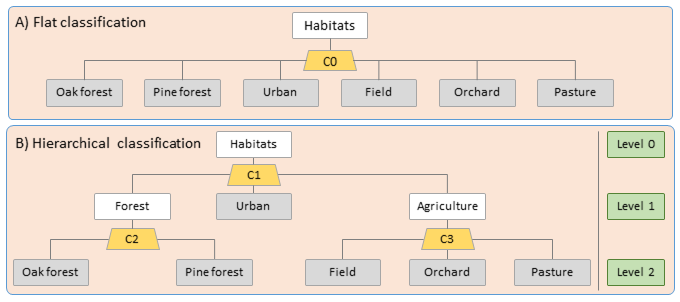
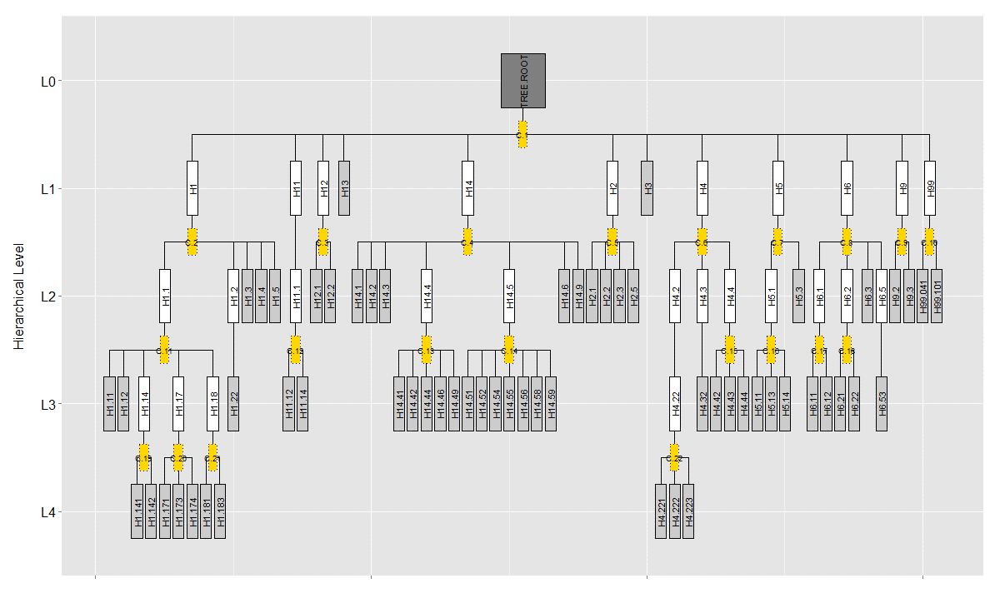
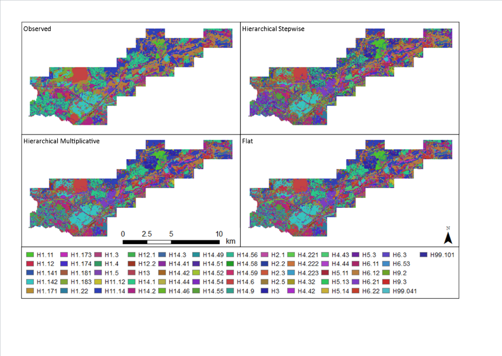

```{r setup, include=FALSE}
library(tufte)
knitr::opts_chunk$set(tidy = FALSE, cache.extra = packageVersion('tufte'))
options(htmltools.dir.version = FALSE)
```

# Habitat classification tool based on hierarchical RandomForest

> For more information, please contact *Yoni Gavish* <mailto:gavishoni@gmail.com>

## Overview

`r newthought("Most national and international habitat")` classification schemes (e.g., EUNIS) have a predefined hierarchical, tree-like structure. For example, in EUNIS, 'broadleaved deciduous woodland' (G1) and 'broadleaved evergreen woodland' (G2) are both siblings of the same parent habitat category of 'woodland, forest and other wooded land' (G). 

However, none of the existing machine-learning classification methods account for (or make use of) this hierarchical structure. We developed an R package implementing the hierarchical *randomForest (HRF)*, which accounts for the hierarchical structure of habitats (Fig. 1). 

```{marginfigure}
*Figure 1.* (A) In flat classification, all habitats (terminal nodes, grey-filled rectangles) are classified in a single local randomForest model (yellow trapezoid, C0), ignoring the class hierarchy. (B) In hierarchical classification, a flat randomForest is used as a local classifier along the class hierarchy (in this case, two levels). Local classifiers are built for every internal node (white-filled rectangles) that has more than one child node. Training cases for ‘oak forest’ are used along those of ‘pine forest’ to represent ‘forest’ in local classifier C1, in addition to their role in local classifier C2.
```



## Expected advantages 

1. *Machine-learning base*: cheap, accurate and dynamic alternative to knowledge-based classification;
1. *More informative variable importance*: Cost-effective identification of specific data needs that may increase accuracy and provide a baseline for knowledge-based classification;
1. *Makes less serious misclassifications than flat models*: e.g., may misclassify one forest type as another, but will not identify it as a pasture;
1. *Flexible use*: defined hierarchical classification scheme facilitates use by many users;
1. Mapping at multiple thematic resolutions: allows users to zoom in and out of the class hierarchy, where required.

## Applicability

The R package (_HieRanFor_) is ready and can be made available upon request. The maps are currently being explored by Simbiotica as a case study for spatial visualization of complex hierarchical thematic data. The following input data are required to fit the HRF model:

- A predefined habitat classification scheme with a hierarchical structure.
- *Input variables*: e.g., remotely-sensed data, earth observation data or environmental data.
- *Ground-truthed data*: e.g., the identity of the habitat according to the habitat classification scheme for a relatively small subset of grid cells, distributed between the relevant focal habitat categories throughout the focal spatial extent.
 
## Potential users

Detailed habitat maps are needed when monitoring change in habitat covers, as input for species distribution models, and for assessing the relative influence of alternative management or impact scenarios on the natural environment. The primary users of the tool are those familiar with other classification methods, while the end users include all decision-makers or researchers that make use of habitat or land cover/land-use maps.

## Case study

We have applied the model to one of EUBON’s focal observatory sites – the Rhine-Main-Observatory (Germany). The habitat classification scheme for the site and the maps were produced using two hierarchical models and one flat model (Figures 2 and 3, respectively). Further details can be found in Milestone 321 and Deliverable 3.1 (available at <http://www.eubon.eu>). 

```{marginfigure}
*Figure 2.* Class hierarchy in the Rhine-Main-Observatory class, constituting of 61 terminal nodes (habitats) arranged in 4 hierarchical levels. To fit a hierarchical randomForest model, 22 local classifiers are required. The image was produced using the plot.HRF function of the HieRanFor package. 
```



```{marginfigure}
Figure 3. The observed and predicted class for each 30 × 30 m2 pixel in the Rhine-Main-Observatory.
```
