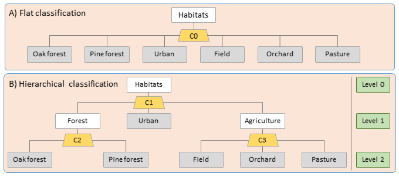
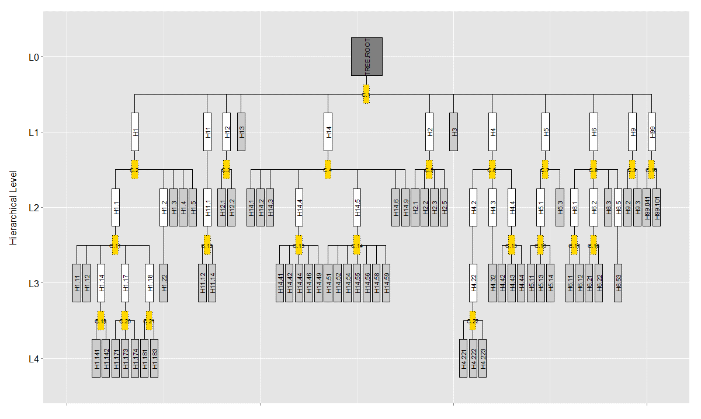

Habitat classification tool based on hierarchical RandomForest
==============================================================

> For more information, please contact *Yoni Gavish*
> [mailto:gavishoni@gmail.com](mailto:gavishoni@gmail.com)

Overview
--------

Most national and international habitat
classification schemes (e.g., EUNIS) have a predefined hierarchical,
tree-like structure. For example, in EUNIS, 'broadleaved deciduous
woodland' (G1) and 'broadleaved evergreen woodland' (G2) are both
siblings of the same parent habitat category of 'woodland, forest and
other wooded land' (G).

However, none of the existing machine-learning classification methods
account for (or make use of) this hierarchical structure. We developed
an R package implementing the hierarchical *randomForest (HRF)*, which
accounts for the hierarchical structure of habitats (Fig. 1).

<label for="tufte-mn-" class="margin-toggle">⊕</label><input type="checkbox" id="tufte-mn-" class="margin-toggle"><em>Figure 1.</em> (A)
In flat classification, all habitats (terminal nodes, grey-filled
rectangles) are classified in a single local randomForest model (yellow
trapezoid, C0), ignoring the class hierarchy. (B) In hierarchical
classification, a flat randomForest is used as a local classifier along
the class hierarchy (in this case, two levels). Local classifiers are
built for every internal node (white-filled rectangles) that has more
than one child node. Training cases for ‘oak forest’ are used along
those of ‘pine forest’ to represent ‘forest’ in local classifier C1, in
addition to their role in local classifier C2.

Expected advantages
-------------------

1.  *Machine-learning base*: cheap, accurate and dynamic alternative to
    knowledge-based classification;
2.  *More informative variable importance*: Cost-effective
    identification of specific data needs that may increase accuracy and
    provide a baseline for knowledge-based classification;
3.  *Makes less serious misclassifications than flat models*: e.g., may
    misclassify one forest type as another, but will not identify it as
    a pasture;
4.  *Flexible use*: defined hierarchical classification scheme
    facilitates use by many users;
5.  Mapping at multiple thematic resolutions: allows users to zoom in
    and out of the class hierarchy, where required.

Applicability
-------------

The R package (*HieRanFor*) is ready and can be made available upon
request. The maps are currently being explored by Simbiotica as a case
study for spatial visualization of complex hierarchical thematic data.
The following input data are required to fit the HRF model:

-   A predefined habitat classification scheme with a hierarchical
    structure.
-   *Input variables*: e.g., remotely-sensed data, earth observation
    data or environmental data.
-   *Ground-truthed data*: e.g., the identity of the habitat according
    to the habitat classification scheme for a relatively small subset
    of grid cells, distributed between the relevant focal habitat
    categories throughout the focal spatial extent.

Potential users
---------------

Detailed habitat maps are needed when monitoring change in habitat
covers, as input for species distribution models, and for assessing the
relative influence of alternative management or impact scenarios on the
natural environment. The primary users of the tool are those familiar
with other classification methods, while the end users include all
decision-makers or researchers that make use of habitat or land
cover/land-use maps.

Case study
----------

We have applied the model to one of EUBON’s focal observatory sites –
the Rhine-Main-Observatory (Germany). The habitat classification scheme
for the site and the maps were produced using two hierarchical models
and one flat model (Figures 2 and 3, respectively). Further details can
be found in Milestone 321 and Deliverable 3.1 (available at
<http://www.eubon.eu>).

<label for="tufte-mn-" class="margin-toggle">⊕</label><input type="checkbox" id="tufte-mn-" class="margin-toggle"><em>Figure 2.</em>
Class hierarchy in the Rhine-Main-Observatory class, constituting of 61
terminal nodes (habitats) arranged in 4 hierarchical levels. To fit a
hierarchical randomForest model, 22 local classifiers are required. The
image was produced using the plot.HRF function of the HieRanFor
package. 

<label for="tufte-mn-" class="margin-toggle">⊕</label><input type="checkbox" id="tufte-mn-" class="margin-toggle">Figure 3. The observed
and predicted class for each 30 × 30 m2 pixel in the
Rhine-Main-Observatory. 
