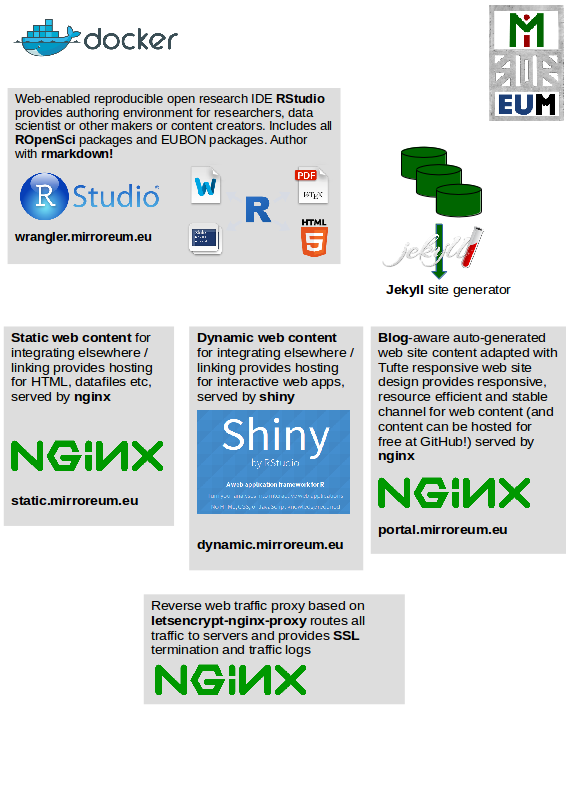

```{r setup, include=FALSE}
library(tufte)
knitr::opts_chunk$set(tidy = FALSE, cache.extra = packageVersion('tufte'))
options(htmltools.dir.version = FALSE)
```

# Mirroreum for EU BON 

[Reproducible Open Research](https://en.wikipedia.org/wiki/Open_research) means being able to share and collaborate on all steps in the chain from raw data to scientific knowledge dissemination. It is the idea that data analyses, and more generally, scientific claims, should be published with their data and software code so that others may verify the findings and build upon them. 

Mirroeum is Free and Open-Source and [openly available at GitHub](https://github.com/raquamaps/mirroreum) and aims at providing a software platform to support reproducible [Open Science](https://en.wikipedia.org/wiki/Open_science) workflows on the web.

# Expected advantages

The need for reproducibility is increasing dramatically as data analyses become more complex, involving larger datasets and more sophisticated computations. Reproducibility allows for people to focus on the actual content of a data analysis, rather than on superficial details reported in a written summary. 

In addition, reproducibility makes an analysis more useful to others because the data and code that actually conducted the analysis are available. 

# Architecture

```{marginfigure}
Figure 1. Overview of the Mirroreum platform for Reproducible Open Research and the Free and Open-Source building blocks that it currently is composed from.
```




# Authoring for the web using markdown

Mirroreum supports, among other formats, authoring to be done using markdown - a simple text format not as complicated as markup formats such as HTML. This brings simplicity and several output formats can be generated from the same markdown source material. From one simple textfile authored in markdown, results can be published in various formats such as [HTML5](https://static.mirroreum.eu), [PDF](https://static.mirroreum.eu/mirroreum.pdf) and [Word](https://static.mirroreum.eu/mirroreum.docx).

For researchers writing articles, the "rticles" package simplifies [producing scientific articles](https://blog.rstudio.org/2016/03/21/r-markdown-custom-formats/) with good typography that also adheres to submission rules from various journals.

# Stakeholders

There are serveral different stakeholders and needs to address for a platform like Mirroreum.

**Citizens and policy makers** constitute an important group that use research results as the basis of decisions and they require that understandable results are communicated clearly in web friendly formats. Mirroreum provides output in blog-aware format with readable simple design adhering to best of breed design principles. This content that you read right now is for example authored and published using Mirroeum and disseminated to this blog-aware portal that uses the [Tufte-Jekyll design theme](https://github.com/clayh53/tufte-jekyll) for styling its content.

**Scientists or researchers** require full insight into raw data and detailed steps to be able to perform peer review their of colleagues work. They need to be able to adhere to reproducible open research methods themselves, in order to enable their peers to review their work and assure high quality results. Mirroreum provides a web-based RStudio interface that fully supports Open Science work and which includes EUBON and ROpenSci packages for convenience.

**DevOps users** is another important group of stakeholder for a software based platform. In order to be able to run Mirroreum in production settings and to be able to further develop the platform in an agile fashion, DevOps stakeholders such as sysadmins and developers need to be able to work with widely used industry best practice methods and tools such as git, docker and docker-compose. 

**Institutions** providing services such as Mirroeum are often funded by tax-payer money and needs to avoid high license costs in operating their services. Institutions also want to avoid problematic lock-in to specific commercial software vendors which may severely hurt the ability to work in an agile fashion and restrict freedoms to innovate. Mirroreum is therefore designed to allow decentralized collaborative development and operations and uses only Free and Open-Source software and technology stacks. It avoids a strictly centralized architecture with the associated risks of being locked in to non-free software stacks or hosting providers.


# Typical usage scenarios

Earlier versions of the Mirroeum platform has been used in web-based online education of students  enrolled in the Masters programme of the Nordic Academy of Biodiversity and Systematic Studies at Stockholm University during the last three years.

Researchers and data scientists will feel at home using RStudio in a web-enabled version running together with all packages from ROpenSci. In addition, many EUBON
contributions in terms of software and tools from WP3 and WP4 are included and conveniently available directly from a web page and thus will not require quirky installs of various software packages locally.

DevOps users will however appreciate that Mirroeum can either be run locally on your laptop or in the cloud on some server. It is the same bits and pieces and almost no
configuration differs. It does not need to be connected to the Internet and can run off-line on a separate network. Developers can add and remove users from within the system, but also change the entire platform to include more components beyond what is currently available by [editing a Dockerfile](https://github.com/raquamaps/mirroreum/blob/master/eubon-rocker/Dockerfile) and rebuilding the platform.

Policy makers and citizens can access research results on the web as interactive web apps or from blogs such as this one. RStudio Shiny is used to provide interactive web apps or dynamic web content while best-of-breed web servers such as nginx with Jekyll are used for publishing static web content which can be integrated elsewhere or linked to on the web.

# Summary

In Mirroreum, researchers or scientists can conveniently work either independently or collaboratively in a web-based RStudio IDE which has been extended with EUBON-specific packages. Computations are done on the cloud server where Mirroreum runs, but Mirroreum can be run locally too, using Docker. DevOps users will appreciate not being locked in to third party services and being able to make changes without involving third parties.

Mirroeum recommends scientists and researchers to use R packages to share everything from raw data through metadata and functionality all the way to the end results, but doesn't require you to [create R packages](http://r-pkgs.had.co.nz/). You can just share some content or functions, so that someone else can work further on your contributions. 

It also provides convenient publishing functionality for markdown-authored work, which allows a simple way to disseminate understandable results to policy makers or end-users in web-friendly formats using appropriate channels, for example using blogs.

The target users of this platform include students for educational purposes, researchers and data scientists for authoring reproducible open research work and policy makers, conservation planners and non-government organizations who take an interest in the results for their decision making. 

Institutions interested in operating Mirroreum in their organization can point their DevOps users to full sources on GitHub where site operators can find recommendations on how to run the system within their own operations.

# Contact details

Please contact Markus Skyttner (markus.skyttner@nrm.se) for more information. 
